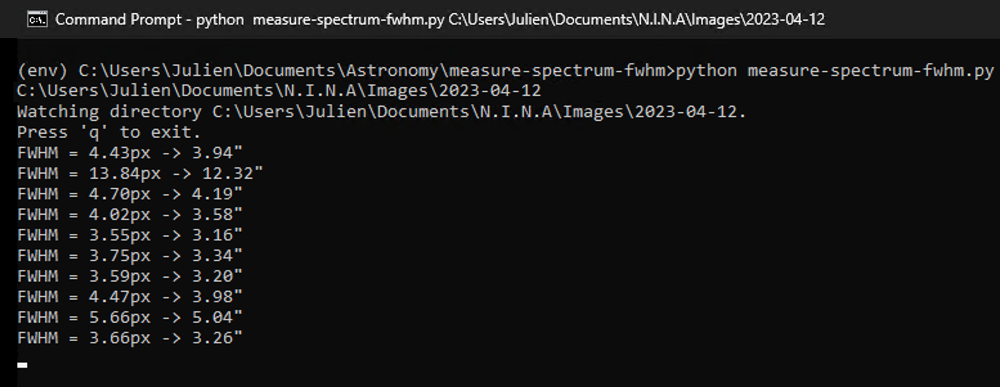

# Measure 2D Spectrum FWHM

In spectroscopy, when acquiring the spectrum of a star, we obtain an image named a "2D spectrum" which looks like this:


One of the biggest challenges in spectroscopy is to properly focus the telescope in order to obtain the finest 2D spectrum that the instrument and the seeing conditions can provide. A sharper 2D spectrum will yield in a higher signal-to-noise ratio in the final spectral profile, so it is important to get this right!

In this repository, I present a very simple Python script that can help you achieve better focus in spectroscopy.

## Installation

After cloning this repository, create a virtual environment using Python 3.x, and activate it:

```
# Create a virtual environment using Python 3.x:
> python -m venv env

# For Mac OS X or Linux:
> source env/bin/activate

# For Windows:
> env\Scripts\activate
```

Then, inside the virtual environment, upgrade `pip`:

```
(env) python -m pip install --upgrade pip
```

Finally, install the dependencies:

```
(env) pip install -r requirements.txt
```

## Usage

This tool relies on the following two reasonable assumptions:

1. The 2D spectrum is in a horizontal orientation (standard in spectroscopy)
2. The 2D spectrum has little to no slant, i.e. it is as close to perfectly horizontal (aligned with the sensor x-axis) as possible.

Start the program by specifying the directory in which your acquisition software will save image files. Example:

```
(env) python measure-2D-spectrum-fwhm.py C:\Users\Julien\Documents\N.I.N.A\Images\2023-04-12
Watching directory C:\Users\Julien\Documents\N.I.N.A\Images\2023-04-12.
Press 'q' to exit.
```

Then, in your image acquisition software, capture a first image of the 2D spectrum. As soon as the image has been stored on disk, as a FITS file (with either the `.fit` or `.fits` extension), the script will attempt to measure the FWHM of the spectrum, and will print the result to the console.

Now, iteratively change the focus position in small steps, and capture a new image after each change in the focus position. Keep an eye on the console to see the evolution of the FWHM. The goal is to find the focus point that minimizes the FWHM. Once you think you have reached that point, you are done, and you can simply press `q` to exit the program. Here is a screenshot of a basic execution:



In the example above, the focus position corresponding to a FWHM of 3.16" was the ideal focus position.

**Note:** Make sure you tweak the value of the parameters at the top of the Python script for optimal results!

## FAQ

You may wonder why I did not go the full nine yards by connecting to the camera and the focuser ASCOM devices directly from within the script and by implementing a real autofocus routine. I thought about doing that, for a few seconds, but the amount of work to get this concept to work well is significant, and I simply did not think that it was worth it. But if you feel courageous, by all means, take a stab at it!
