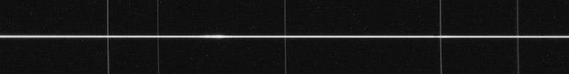

# Measure 2D Spectrum FWHM And Signal

In spectroscopy, when acquiring the spectrum of a star, we obtain an image called a "2D spectrum" which looks like this:



One of the biggest challenges in spectroscopy is to properly focus the telescope in order to obtain the finest 2D spectrum that the instrument and the seeing conditions can provide. A sharper 2D spectrum will yield in a higher signal-to-noise ratio in the final spectral profile, so it is important to get this right!

In this repository, I present a very simple Python script that can help you achieve better focus in spectroscopy.

## Installation

After cloning this repository, create a virtual environment using Python 3.x, and activate it:

```
# Create a virtual environment using Python 3.x:
> python -m venv env

# For Mac OS X or Linux:
> source env/bin/activate

# For Windows:
> env\Scripts\activate
```

Then, inside the virtual environment, upgrade `pip`:

```
(env) python -m pip install --upgrade pip
```

Finally, install the dependencies:

```
(env) pip install -r requirements.txt
```

## Usage

This tool relies on the following two reasonable assumptions:

1. The 2D spectrum is in a horizontal orientation (standard in spectroscopy)
2. The 2D spectrum has little to no slant, i.e. it is as close to perfectly horizontal (aligned with the sensor x-axis) as possible.

Start the program by specifying the directory in which your acquisition software will save image files. Example:

```
(env) python measure-2D-spectrum-fwhm.py C:\Users\Julien\Documents\N.I.N.A\Images\2023-04-12
Watching directory C:\Users\Julien\Documents\N.I.N.A\Images\2023-04-12
Press 'q' to exit
```

Then, in your image acquisition software, capture a first image of the 2D spectrum. As soon as the image has been stored on disk (in the directory watched by this script) as a FITS file (with either the `.fit` or `.fits` extension), the script will read the new file, attempt to measure the FWHM of the 2D spectrum it contains, and print the result to the console. It will also print a normalized maximum value (NMAX) as a way to gauge the amount of signal going through the slit. Indeed, in some spectrograph designs, astigmatism is always present (the UVEX for example) so the narrowest spectrum does not always equal the best SNR. The target should be to get as much of the light through the slit as possible, so it is important to use these two numbers together to decide when you have reached best focus.

Now, iteratively change the focus position in small steps, and capture a new image after each change in the focus position. Keep an eye on the console to see the evolution of the FWHM and the NMAX values. The goal is to find the focus point that maximizes the NMAX / minimizes the FWHM. Here is an example of a basic execution:

```
(env) C:\Users\Julien\Astronomy> python measure-2D-spectrum-fwhm C:\Users\Julien\Documents\N.I.N.A\Images\2023-4-12
Watching directory C:\Users\Julien\Documents\N.I.N.A\Images\2023-4-12
Press 'q' to exit
HD097633_00001.fits: FWHM = 4.43px -> 3.94" | NMAX = 59.17
HD097633_00002.fits: FWHM = 4.02px -> 3.58" | NMAX = 62.87
HD097633_00003.fits: FWHM = 3.55px -> 3.16" | NMAX = 64.28
HD097633_00004.fits: FWHM = 3.75px -> 3.34" | NMAX = 63.32
HD097633_00005.fits: FWHM = 4.47px -> 3.98" | NMAX = 59.05
HD097633_00006.fits: FWHM = 5.66px -> 5.04" | NMAX = 55.41
```

Remember which focus value you had when capturing each image. In the execution above, `HD097633_00003.fits` was clearly the sharpest / brightest spectrum. Once you think you have reached that point, you are done, and you can simply press `q` to exit the program.

**Note:** Make sure you tweak the value of the parameters at the top of the Python script for optimal results!

## FAQ

You may wonder why I did not go the whole nine yards by connecting directly to the camera and the focuser ASCOM devices from within the script to implement a real autofocus routine. I thought about doing that, for a few seconds, but the amount of work to get this concept to work well is significant, and I simply did not think that it was worth it. But if you feel courageous, by all means, take a stab at it! Among other things, you would need to implement all the necessary camera controls as well as render the image captured by the camera as a way to verify that you are indeed imaging a spectrum... (and that would include implementing an image stretch algorithm since short exposure images will be quite dark). You would also need to think about focuser backlash compensation, and you would need to take into account focuser shift, which means that you would need to let your autoguiding software "catch up" between focus changes. And when all is said and done, your script would only work on Windows because ASCOM is only available on that platform. So would that be worth your time and energy? I will let you decide.
