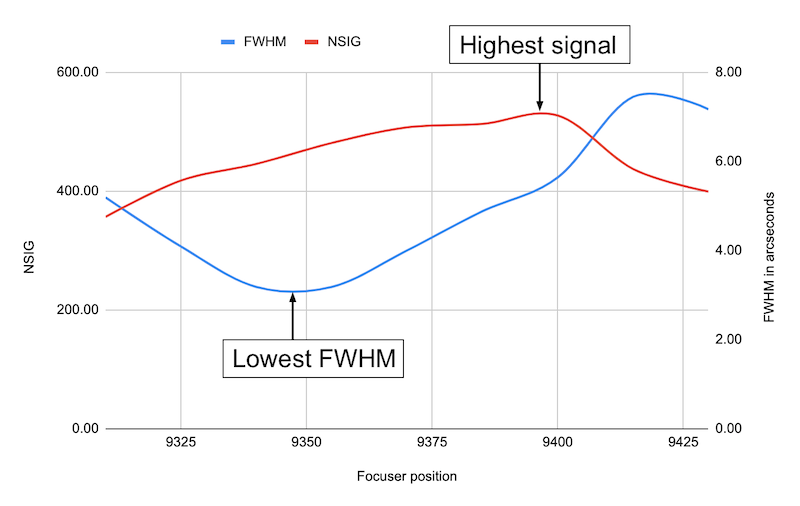
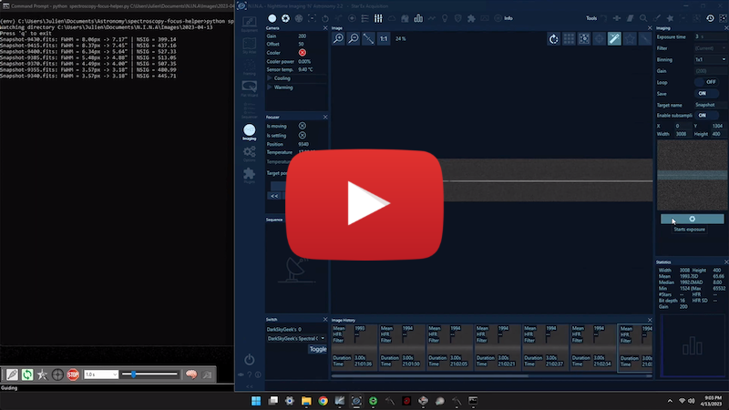

# Spectroscopy Focus Helper

In spectroscopy, when acquiring the spectrum of a star, we obtain an image called a "2D spectrum" which looks like this:


One of the biggest challenges in spectroscopy is to properly focus the telescope in order to obtain the highest amount of useful signal going through the slit that the instrument and the current seeing conditions can provide. In this repository, I present a very simple Python script that can help you achieve better focus in spectroscopy.

## Installation

After cloning this repository, create a virtual environment using Python 3.x, and activate it:

```
# Create a virtual environment using Python 3.x:
> python -m venv env

# For Mac OS X or Linux:
> source env/bin/activate

# For Windows:
> env\Scripts\activate
```

Then, inside the virtual environment, upgrade `pip`:

```
(env) python -m pip install --upgrade pip
```

Finally, install the dependencies:

```
(env) pip install -r requirements.txt
```

## Usage

This tool relies on the following two reasonable assumptions:

1. The 2D spectrum is in a horizontal orientation (standard in spectroscopy)
2. The 2D spectrum has little to no slant, i.e. it is as close to perfectly horizontal (aligned with the sensor x-axis) as possible.

Start the program by specifying the directory in which your acquisition software will save image files. Example:

```
(env) python spectroscopy-focus-helper.py C:\Users\Julien\Documents\N.I.N.A\Images\2023-04-12
Watching directory C:\Users\Julien\Documents\N.I.N.A\Images\2023-04-12
Press 'q' to exit
```

Then, in your image acquisition software, capture a first image of the 2D spectrum. As soon as the image has been saved to the directory watched by this script as a FITS file (with either the `.fit` or `.fits` extension), the script will read the new file, and attempt to measure the 2D spectrum it contains. It will print the FWHM of the 2D spectrum as well as a normalized value of the overall signal (NSIG) contained in the 2D spectrum. Indeed, in some spectrograph designs, astigmatism is always present (case of the UVEX for example) so the narrowest spectrum does not always equal the best SNR. The target should be to get as much of the light going through the slit as possible, so it is important to use these two numbers together to decide when you have reached best focus.

Now, iteratively change the focus position in small steps, and capture a new image after each change in the focus position. Keep an eye on the console to see the evolution of the FWHM and the NSIG values. The goal is to find the focus point that maximizes the NSIG / minimizes the FWHM.

**Note:** If your image acquisition software supports it, it is helpful to have the focuser position as part of the file name. In [N.I.N.A.](https://nighttime-imaging.eu/), you can use `$$FOCUSERPOSITION$$`.

Here is an example of a basic execution:

```
(env) C:\Users\Julien\Astronomy> python spectroscopy-focus-helper.py C:\Users\Julien\Documents\N.I.N.A.\Images\2023-4-13
Watching directory C:\Users\Julien\Documents\N.I.N.A.\Images\2023-4-13
Press 'q' to exit
HD097633-9430.fits: FWHM = 8.06px -> 7.17" | NSIG = 399.14
HD097633-9415.fits: FWHM = 8.37px -> 7.45" | NSIG = 437.16
HD097633-9400.fits: FWHM = 6.34px -> 5.64" | NSIG = 527.33
HD097633-9385.fits: FWHM = 5.48px -> 4.88" | NSIG = 513.05
HD097633-9370.fits: FWHM = 4.49px -> 4.00" | NSIG = 507.35
HD097633-9355.fits: FWHM = 3.57px -> 3.18" | NSIG = 480.99
HD097633-9340.fits: FWHM = 3.57px -> 3.18" | NSIG = 445.71
HD097633-9325.fits: FWHM = 4.60px -> 4.09" | NSIG = 417.71
HD097633-9310.fits: FWHM = 5.83px -> 5.19" | NSIG = 356.66
```

If you did not include the focuser position in the file name, you will have to remember which focus position you had when capturing each image.

Once you are done, and you can simply press `q` to exit the program.

**Note:** Make sure you tweak the value of the parameters at the top of the Python script for optimal results!

**Note:** Sharp-eyed readers will have noticed that the spectrum with the lowest FWHM is indeed not the spectrum with the most signal. Here is a graph of FWHM and NSIG as a function of the focuser position:



In the case of Star'Ex, this small difference (which amounts to about 0.2mm of length on the focuser draw tube) may be explained by many factors, including:

* The collimating lens may not be perfectly focused. In the absence of a fine focus system, this is to be expected.
* A chromatic effect (I use a refracting telescope) since the guide camera looks at the entirety of the visible spectrum while the imaging camera looks at H-alpha (deep red).
* Atmospheric dispersion.

In the end, a compromise can be attained, which allows for better centering/guiding without significantly impacting the total amount of signal going through the slit.

## Demo

Check out this video recording of a sample session using this tool:

[](https://www.youtube.com/watch?v=Fphfr63r40E)

## FAQ

You may wonder why I did not go the whole nine yards by connecting directly to the camera and the focuser ASCOM devices from within the script to implement a real autofocus routine. I thought about doing that, for a few seconds, but the amount of work to get this concept to work well is significant, and I simply did not think that it was worth it. But if you feel courageous, by all means, take a stab at it! Among other things, you would need to implement all the necessary camera controls as well as render the image captured by the camera as a way to verify that you are indeed imaging a spectrum... (and that would include implementing an image stretch algorithm since short exposure images will be quite dark). You would also need to think about focuser backlash compensation, and you would need to take into account focuser shift, which means that you would need to let your autoguiding software "catch up" between focus changes. And when all is said and done, your script would only work on Windows because ASCOM is only available on that platform. So would that be worth your time and energy? I will let you decide.
